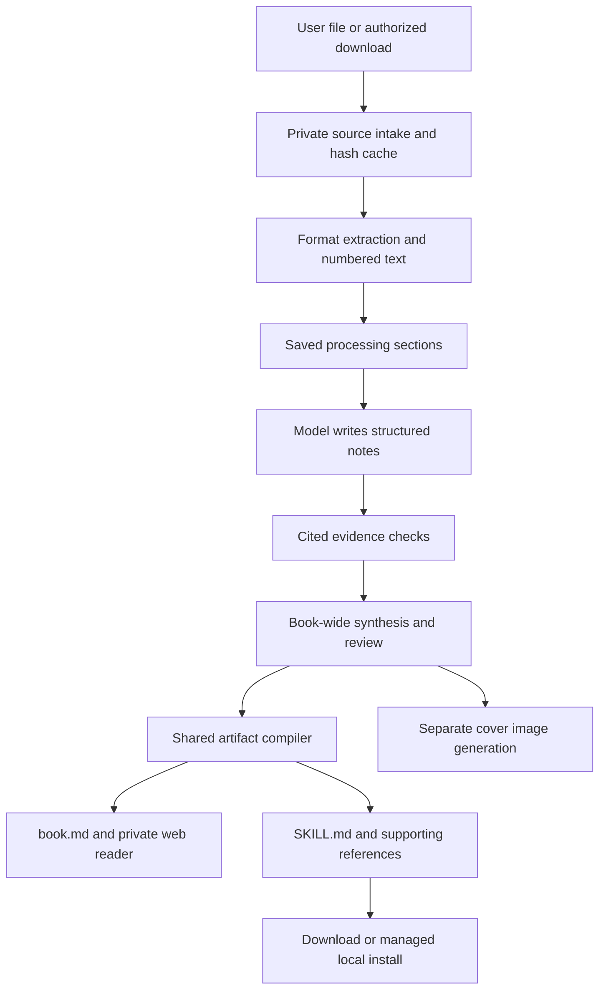

# Book processing: architecture, parity, performance, and model evaluation

Audited October 7, 2026 (America/Los_Angeles), against web main `a68ba957e9bd18d82601946fef6156d0987bdaee`, the installed CLI v0.3.0, and upstream `book-to-skill` v1.4.0 / `e180fc46365e8c1aab0120778cc8a40b9515324b`. The upstream HEAD still matched that revision during this audit. Changes described as new below require deployment; this document is not a production acceptance receipt.

## What upstream does, and what we do

The [upstream project](https://github.com/virgiliojr94/book-to-skill/tree/e180fc46365e8c1aab0120778cc8a40b9515324b) has two distinct parts:

1. Python tools deterministically extract documents, sanitize text, detect provisional structure, estimate tokens, validate skill files, and scan generated content.
2. Its `SKILL.md` instructs the user's existing agent to read that text, identify useful methods, write a main skill and supporting files, validate them, and install them. The host agent supplies the language model. Running the extractor alone does not generate a skill.

We vendor upstream's MIT-licensed Python code unmodified, with checksums and attribution. Our adapters execute it; browser PDF extraction uses PDF.js, while technical PDFs use the native Docling path and DRM-free Kindle formats use upstream's Calibre dispatcher. Browser/ordinary CLI Python runs inside Pyodide. The application adds routing, structure mapping and exact technical references. We also carry selected upstream generation guidance, adapted to our structured representation; we do not execute the whole upstream agent workflow verbatim.

Our hosted writer makes structured model calls, checks the notes, and renders their contents into several files deterministically. The model does not separately rewrite the same idea for every output file.



Relevant implementations: [`book-process/index.ts`](../supabase/functions/book-process/index.ts), [`book-distillation.mjs`](../supabase/functions/_shared/book-distillation.mjs), [`book-artifacts.mjs`](../supabase/functions/_shared/book-artifacts.mjs), and [source/revision behavior](BOOK_SOURCE_SKILLS.md).

## Does generation include all the skill files and the website content?

**For private source uploads: yes, the core skill file set and readable book come from the same source and checked notes.** Cover generation is a separate model call at the end.

| Output or behavior | Upstream agent workflow | Our private source pipeline |
| --- | --- | --- |
| Main `SKILL.md` | Written by host agent | Rendered from checked notes and synthesis |
| Chapter notes | Agent-selected chapters | `skill/chapters/chNN.md`; processing sections with a provisional original-chapter map |
| Glossary | Agent-written | Synthesized terms with chapter references |
| Patterns | Agent-written | Rendered from the same retained ideas |
| Cheatsheet | Agent-written decision guidance | Decision rules, first actions, limits, and application basis |
| Topic index and on-demand references | Agent instructions | Explicit index and paginated large reference files |
| Readable book summary | Optional agent output | `book.md`, also displayed in the private reader |
| Cover and account shelf | Outside the core workflow | Generated illustration and private library entry |
| Provenance | Source fingerprints and extraction metadata | Source hashes, exact citation source, source map, review report, package/revision identity |
| Revisions | Agent-directed fold-in | Append or replace source; review before activation; retain previous versions |

File-name parity does not establish equal reasoning depth, source fidelity, or useful answers. Our chapter files are processing sections, not a guarantee of one file per original chapter. Upstream supports richer bespoke chapter structure and agent-directed reconciliation. Our application favors consistency and traceability.

**The public editorial generator is a different route.** [`generate-book-wave.mjs`](../scripts/generate-book-wave.mjs) researches primary web sources and drafts public digest Markdown. [`generate-cover-assets.mjs`](../scripts/generate-cover-assets.mjs) produces public covers separately. Public digests are not retroactively full-source skills. Uploading a private book does not publish it to the public catalog. The private Create book & skill flow on `/tools/` and the private reader is the unified source workflow above.

## Why the initial sample looked faster

The earlier three-chapter pilot measured 65.61 seconds from hosted job creation to ready, versus 275.11 seconds for the upstream guide executed by the conversational agent. The latter included tool operations and interleaved benchmark checks. Those are different timing boundaries, models, prompts, and output volumes. There was one generation per route.

The plausible architectural advantage is fewer conversational round trips and deterministic rendering of shared notes into many files. The benchmark does not isolate how much of the difference came from that design or the model. It does not establish a general 4.2× advantage.

Extraction went the other way: the full EPUB median was 8.89 seconds through our CLI versus 1.87 seconds through upstream's native Python, three runs each. Our measured path starts a Pyodide runtime; extraction speed and output completeness must be evaluated separately.

More seriously, the hosted result invented a commodity-value section supported only by the excerpt label and source credit. Its automated fidelity check passed. Speed without acceptable source fidelity is not a product win.

For the full Smith source, 117 sequential sections imply at least 234 section generation/review calls, plus overview groups, synthesis, cover, queue delays, and retries. Four global workers and two per account do not mean sections within one book run concurrently. Failed sections back off up to five minutes. Processing continues on the server after upload and does not require the browser or chat to stay open.

## Improvements in this change

- Merge a short untitled title/provenance prefix into the first substantive section when the size bound permits. Preserve every line and citation offset. This fixes the observed extra metadata section; it is not a general classifier for all front matter.
- Use strict output schemas, including each section's allowed citation coordinates and the exact number and permitted IDs of claim checks. Keep independent validation for citation ranges and missing, duplicated, failed or unknown checks.
- Give the reviewer each summary, idea, example and anti-pattern with only its cited excerpts. A citation elsewhere in the section is insufficient for that note.
- Require an application basis. Render inferred applications distinctly from procedures the source actually prescribes. Earlier packages with no basis say it was not recorded.
- Preserve conditional language, numerical qualifications, excerpt scope and historical attribution in generation guidance.
- Support separate generation/review models and reasoning settings. Modern reasoning models use compatible completion-token parameters. The follow-up model selection now sets GPT-5.4 mini as the source default; deployment and release acceptance remain pending (see HOSTED_BOOK_LIBRARY.md).
- Record sanitized provider model IDs, token counts, cached/reasoning tokens, outcomes and timings. No source, prompts, keys or provider error bodies enter these metrics. Worker logs are not yet a persistent per-book billing receipt.
- Version the review report and distinguish old, partial and complete checks in downloads and the private reader. Preserve access to both v2 and v3 repair snapshots within the owning book's storage prefix. Do not relabel old notes as freshly reviewed.
- Add a bounded provider comparison using the same distillation and compilation code as production. Dry-run is the default; live execution is explicit, writes to a new directory, and never retries silently.

Strict schemas enforce shape, not truth. The live trials found false acceptances even after these changes; human source checks remain a release gate.

## Models and bounded evaluation

At the original audit, deployed source defaults were `gpt-4.1-mini` for text and `gpt-image-1.5` for private covers; environment overrides can differ. Public editorial scripts have separate model settings. Changing a local CLI setting does not change the server's model.

Current standard short-context text rates, checked October 7, 2026:

| Model | Input / 1M tokens | Output / 1M tokens | Candidate role |
| --- | ---: | ---: | --- |
| [GPT-4.1 Mini](https://developers.openai.com/api/docs/models/gpt-4.1-mini) | $0.40 | $1.60 | Existing baseline |
| [GPT-6 Luna](https://developers.openai.com/api/docs/models/gpt-6-luna) | $0.10 | $0.50 | Lower-cost generation or review candidate |
| [GPT-6.1 Sol](https://developers.openai.com/api/docs/models/gpt-6.1-sol) | $2.00 | $10.00 | Stronger writing and evidence review candidate |

These are provider rates, not a per-book customer price. Covers, failed attempts, cache behavior, hosting and service pricing are separate. Newer models do not automatically produce a faster acceptable package.

Run a plan without credentials or provider traffic:

```sh
node scripts/benchmark-book-models.mjs --source /absolute/path/to/extracted-sample.txt
```

With `OPENAI_API_KEY` already in the process environment, run selected profiles into a **new** output directory:

```sh
node scripts/benchmark-book-models.mjs \
  --source /absolute/path/to/extracted-sample.txt \
  --output /absolute/path/to/new-evaluation-directory \
  --profiles baseline,fast,strong-review,quality --run
```

The harness accepts at most 75,000 characters and six sections, caps output at 6,000 tokens per call, and has no automatic retries. It measures text generation, review and compilation; it excludes extraction, upload, queueing, cover, installation and human review. Reports retain rejected runs and actual provider usage. A failed review is not a completed conversion.

Configure independent server roles only after evaluation:

```text
BOOK_PROCESSING_MODEL=<selected writer>
BOOK_REVIEW_MODEL=<selected reviewer>
BOOK_REASONING_EFFORT=<supported effort>
BOOK_REVIEW_REASONING_EFFORT=<supported effort>
```

GPT-6 Luna supports `none`; GPT-6.1 Sol requires `low` or higher. The candidate fast profiles use Luna with `none` for writing and `low` for review. The quality profile uses Sol with `low` for both. This change does not switch production settings or the cover model.

### Actual trial results

The fixed source was the same 6,931-word, 39,877-character Smith excerpt (SHA-256 `1ee61af824a58667dfcd701cf13e65e0735a05826e6f15b87b1d09519db5a7b0`). See the [sanitized usage and outcome receipt](verification/book-models-2026-10-08/results.json), which retains all failed runs and records prompt/configuration changes between trials.

| Trial | Writer / reviewer | Time to completion or rejection | Outcome | Estimated text cost |
| --- | --- | ---: | --- | ---: |
| v2 | Mini / Mini | 46.38 s | All 3 sections and artifacts completed; **failed manual source audit** | $0.0285 |
| v2 | Luna / Luna | 30.14 s | First section rejected: summary imported a later chapter's market-extent claim | $0.0037 |
| v2 | Luna / Sol | 35.78 s | First section rejected: conditional pin-production capacity became routine output | $0.0381 |
| v3 | Sol / Sol | 175.27 s | All 3 sections, synthesis, checks and artifacts completed; major-claim source spot audit passed | $0.1624 |

The earlier v1 attempt also failed all three profiles; its receipts are retained. There were 28 provider requests across all trials, with approximately $0.2881 in estimated standard text charges before cache adjustments and any additional fees. These estimates use actual returned token counts, not guessed token counts, but they are not billing receipts. Failed trials are partial work and their costs are not costs of a usable package.

Mini's manual failures included labeling descriptive material as author-prescribed instructions, treating historical classifications as current facts, and adding qualifications without the relevant citation. Sol's spot audit checked the three productivity mechanisms, the conditional 48,000-pin group capacity and 4,800 allocation, exchange versus charity, developed talents, market constraints, transport comparisons, and the distinction between a source procedure and a derived organizational application. The newer output preserved those distinctions. It does not establish a full theory of morale, bureaucracy or spans of control from three chapters.

This was a small development evaluation, not a blinded model ranking. Prompts evolved after observed failures, there was one completed Sol conversion, and the auditor was the implementing agent. Sol is the stronger quality candidate on this sample; it is **not** faster or cheaper than Mini's unaccepted output. Luna's lower listed price does not establish a lower cost per acceptable book. Keep model changes configurable and validate additional genres and difficult full-book sections before changing the production default.

The existing full-book job was separately observed failed at 92 of 117 sections with an out-of-range citation error. It has no completed full-book skill. New schemas bound citation coordinates, but they do not retroactively recheck old notes or repair existing jobs. No full-library backfill or production model change was run.

### Verification and release boundary

- `npm run test:book-pipeline`: 42 passing tests, covering extraction/compilation contracts, long sources, revisions, cited evidence checks, modern model requests, sanitized telemetry, review-version compatibility and the bounded evaluation harness.
- `deno check --no-lock --node-modules-dir=auto supabase/functions/book-process/index.ts`: passed.
- `deno run --no-lock --node-modules-dir=auto --allow-env --allow-read scripts/test-book-worker-http.ts`: passed. This exercises the actual handler with synthetic HTTP dependencies, including 77 sections, 7 overview groups, authentication, ownership, retry/pause races, exports and covers. It is not a live queue deployment test.
- Astro build with Node 22: 115 pages built successfully, including the updated private-reader review notice. No new browser interaction acceptance was performed for this change.
- The live model trials above used real OpenAI responses through the new client and distillation path. They did not use the production queue or alter stored user books.

Release requires the reviewed backend and frontend changes, deliberate model selection, a real private upload-to-export smoke test, and source review of the result. Existing jobs retain their saved notes and chunk boundaries. A v3 report on a mixed old/new job must disclose partial check coverage; it is not a substitute for reprocessing or repair. Do not run a library-wide repair automatically.

## How users call and install it

There are two installations:

1. **The generic Answer With Books guide and runtime.** The v0.3.0 `npx … install --skill --api` command copies `SKILL.md`, CLI code, bundled extraction assets and catalog data locally. `--api` also writes optional local HTTP-server configuration; it does not start a paid model or run a hosted backend locally. This is a packaged release, not a user Git clone.
2. **Each generated book skill.** After login and processing, `library install-book BOOK_ID` exports the current account-owned package, verifies its identity and paths, and installs its complete source/reference files in a managed account cache. A local skill-directory link points to the immutable revision. `library sync` can update that link while preserving old versions and refusing to overwrite user-edited or unmanaged skills.

Users can simply ask their agent: “Use Answer With Books to turn this EPUB into a summary and installable skill.” They may attach a file, provide a local path, or choose an authorized downloadable source. For an explicit Codex invocation, use `$answer-with-books`. A title preference alone is not an upload request.

The guide drives these commands through the pinned `npx` release or its bundled runtime:

```text
login
upload /path/to/book.epub --process-file --mode full
status BOOK_ID
download BOOK_ID --output ./book-and-skill.zip
library install-book BOOK_ID
library sync
```

The executable prefix is `npx --yes https://github.com/Crowdlisten/Crowdlisten_books/releases/download/v0.3.0/answer-with-books-0.3.0.tgz`. It need not be a globally installed binary. The agent reads the installed book's `SKILL.md`, loads only relevant chapter files, and checks cited source lines when applying its methods. The generated files do not call a model themselves; the user's active agent does the reasoning. Source upload/generation uses the service's model account, while later agent use consumes the host agent's normal usage.

## Remaining work to earn an overall advantage

| Priority | Current limit | Measurable next gate |
| --- | --- | --- |
| 1 | Some models pass unsupported prescriptions or produce notes another reviewer rejects | Independent source audit across several genres; test rejected drafts as well as accepted drafts; compare acceptable-package rate |
| 2 | Retry restarts generation without structured feedback from the failed review | Persist a rejected draft and cited issues; bounded repair with re-review, without accepting unchecked notes |
| 3 | Sequential per-book calls and delayed retries dominate long books | Stage-specific latency and failure measurements; bounded independent section concurrency with ordered, source-preserving assembly |
| 4 | CLI Pyodide startup is slower than native extraction | Reuse a warmed runtime for batches or offer a tested native path; compare identical extraction outputs and formats |
| 5 | Managed installation waits for `ready`, which includes the cover | Separate text/skill readiness from optional image completion; retain cover retry without regenerating text |
| 6 | Usage logs are not an account-facing cost receipt | Persist per-job model/usage/attempt totals and separately disclose the customer tariff and estimated final cost |
| 7 | Upstream has folder/glob intake, combined collections, free-form fold-in and host-specific flexibility | Add only the needed workflows and test their semantics; current separate-file batches are deliberate |

Upstream's local execution and freely chosen host model remain useful advantages. A hosted product cannot claim to beat every privacy, offline, cost and customization preference merely by adding features. The target is a reliably better default for turning an authorized source into an accurate, readable, reusable book package.

## Follow-up: inexpensive models, parallel sections, and hosted routing

See [Hosted book library](HOSTED_BOOK_LIBRARY.md) for the October 8 follow-up implementation and measured outcomes. It adds bounded section concurrency, preserves accepted work around failures, evaluates GPT-5.4 nano/mini and exact GPT-5.5, and implements account-scoped hybrid chapter retrieval plus a separate embedding queue. The matching CLI adds one-guide hosted routing. The new work is locally tested and remains undeployed; the report distinguishes pipeline completion from source quality and provider cost from customer charges.
